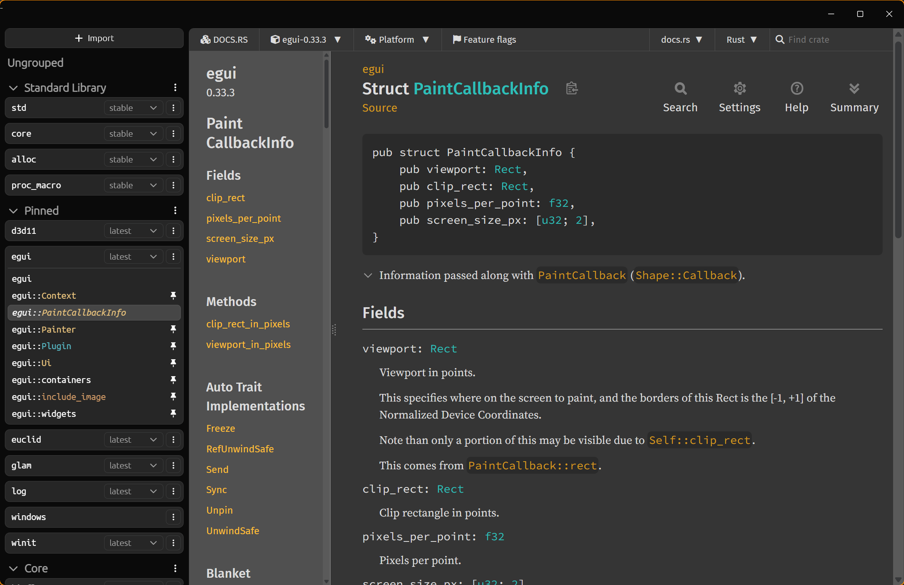

# TurboDoc

A local-first documentation viewer for Rust developers.



## Motivation

Documentation viewers like Zeal and Dash work well for some languages like C++, but Rust's ecosystem lives on docs.rs — and offline doc bundles can't keep up with rapidly-evolving crates and their cross-linked dependencies. I found myself juggling dozens of browser tabs across docs.rs, the standard library, and crate references, often losing track of focus along the way.

TurboDoc is a dedicated viewer that proxies and caches docs.rs locally, lets you organize crates into named groups, pin pages, and follow cross-crate links seamlessly. Reading documentation is a workspace activity — the tool should help you manage your references, not fight against them.

## Features

- **Unified Rust docs** — browse docs.rs, doc.rust-lang.org, and windows-docs-rs as a single provider
- **Local HTTP proxy with SQLite cache** — documentation loads instantly after the first visit; stale-while-revalidate keeps things fresh in the background
- **Pin/unpin pages** — VS Code-style preview tabs: navigate freely, pin the pages you want to keep
- **Version selection** — semver-grouped version picker with "latest" tracking that auto-updates
- **Named groups** — organize crates into collapsible groups with drag-free reordering
- **Cross-crate navigation** — follow a link to `std::vec::Vec` from a docs.rs page and TurboDoc auto-imports the crate
- **Symbol parsing** — module paths and type names colored
- **Dark mode injection** — rustdoc pages served in dark mode at the proxy level, no flicker
- **Extensible provider architecture** — adding a new documentation source (C++, Python, etc.) means implementing a single `Provider` interface

## Getting Started

> **Windows only** — TurboDoc uses WebView2, which requires Windows 10/11.

### Prerequisites

- [Rust toolchain](https://rustup.rs/) (for the host app)
- [Bun](https://bun.sh/) (JavaScript runtime)
- [just](https://github.com/casey/just) (task runner)

### Build & Run

```sh
just install   # Install dependencies for server/ and frontend/
cargo run      # Run TurboDoc
```

### Tech Stack

| Layer | Technologies |
|-------|-------------|
| **Host** | Rust · winit · webview2-com · WebView2 |
| **Server** | TypeScript · Bun · Hono · SQLite (bun:sqlite) |
| **Frontend** | React 19 · Vite 7 · Tailwind CSS v4 · HeroUI v3 · Immer |
| **Tooling** | just (task runner) · Biome (linter) |

## Architecture

TurboDoc is a three-layer desktop application:

```
┌──────────────────────────────────────────────────────────────┐
│  Host (Rust + WebView2)                                      │
│  Window shell — intercepts doc requests, forwards to server  │
├──────────────────────────────────────────────────────────────┤
│  Server (Bun + Hono)                                         │
│  REST API, HTTP proxy with SQLite cache, dark mode injection │
├──────────────────────────────────────────────────────────────┤
│  Frontend (React 19 + Vite 7)                                │
│  Explorer sidebar, iframe documentation viewer               │
└──────────────────────────────────────────────────────────────┘
```

The host is a thin Rust process that spawns the server, opens a WebView2 window, and gets out of the way — all logic lives in the server and frontend. When the WebView2 iframe navigates to a documentation URL, the host intercepts the request and forwards it to the server's `/proxy` endpoint. The server checks its SQLite cache (RFC 7234 freshness, LRU eviction) and either serves the cached response or fetches upstream:

```
iframe navigates to https://docs.rs/serde/latest/serde/
  → Host intercepts, forwards to Server /proxy?url=...
    → Cache HIT:  serve cached + dark mode injection
    → Cache MISS: fetch upstream, cache, serve
  → Host fires "navigated" event to Frontend
    → Frontend auto-detects crate, updates sidebar state
```

## License

[GPL-3.0](LICENSE)
